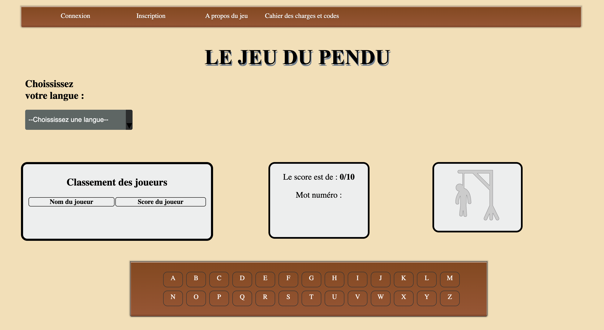
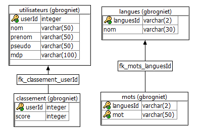

# Projet DevWeb : jeu du pendu

Pour des informations plus précises et complétent, nous vous invitons à aller ce le wiki du projet : https://github.com/MMichotte/DevWeb-1/wiki

# Présentation de l'équipe
  Pour la réalisation de ce projet, nous sommes un groupe de 4 personnes :
   - Martin Michotte
   - Martin Perdeans
   - Geoffrey Brogniet
   - Maxime de Cock 
# Besoin du client

  Nous désirons une page web qui permet de jouer au fameux jeu du Pendu. Le but serait de pouvoir taper via le clavier les lettres du mots, de voir au fur et à mesure des fautes le bonhomme se faire pendre mais aussi d'avoir un classement des joueurs avec les scores.

  Ce qui serait bien aussi est la possibilité de pouvoir rajouter les mots qu'on veut dans la base de donnée, afin que le jeu nous ressemble un peu plus.
# Fonctionnalités principales

    - Une page html comportant un clavier virtuel, un image dynamique et l'appartition du mot qui bien sûr est à découvrir.

    - Le tableau du classement des joueurs.

    - Une page de connexion/d'inscription qui nous permet de jouer et d'enregristrer notre score dans la base de donnée.

# Fonctionnalités supplémentaires

    - Possibilité pour l'utilisateur de rajouter des mots via un fichier csv ou un fichier qui contient une liste de mot.
    - Possibilité de rajouter une langue dans la base de données. 
    - Une page qui permet de rajouter des mots.
    
    
# Implémentation : aprroche technique 

Nous avons divisé notre réalisation en deux grandes catégories, le back-end qui va être la création de la table de données via Sybase mais également les procédures et les services dont notre page Web aura besoin. Et nous aurons la partie front-end qui va être la structure même de la page, les scripts et la mise en forme de notre page Web. 

## Partie back-end 

1. Une base de données qui va enregistrer les mots et les scores. 

2. Un serveur web qui sera capable de nous fournir les pages HTML, JS et CSS, ainsi que de proposer des Web Services

3. Des Web Services (avec les procédures associées) : 

    - Un Web Service capable de récupérer les mots et les placer dans l'HTML
    - Un Web Service capable de récupérer la langue souhaité et donc d'y proposer les mots de la langue choisie
    - Un Web Service capable d'ajouter et de récupérer les scores de la table de score ainsi que les nom des joueurs
    - Un Web Service qui va nous permettre de se connecter à la page et nous permettre de jouer au jeu
    
## Partie front-end 

1. Une page Web (HTLM, JS, CSS) permettant d'appeler les webservices et de traiter les réponses, qui propose une interface utilisateur pour :

    - Se connecter ou créer un compte 
    - Taper sur son clavier physique afin de chercher le mot
    - Choisir sa langue pour le jeu
    - Retenir le score de la personne qui joue et l'envoyer via une requête à la base de données
    - Appeler les images de la base de données et les afficher lorsque la personne se trompe de lettre. 
    

# Style de la page voulu :

# Tables de la base de données  

                                                                        
                                                                        
                                                                    
